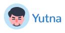

# Iron Software - Challenge

> Front-End developer challenge from Iron Software

Based on the [requirements](docs/Front_End_Developer_Challenge.pdf), for simplicity, I plan to use only HTML and CSS without any fancy setup. You can clone this repository to your local machine and initiate your development environment with your preferred server.

In my case, I am using the following command:

```bash
php -S localhost:3000
```

or

```bash
python3 -m http.server
```

If you are a Node.js developer, you can also utilize the [http-server](https://www.npmjs.com/package/http-server) tool.

## About font

In Figma, you will notice that the design file uses the *Gotham* font. However, *Gotham* is not a free font. I conducted research to find an alternative font and came across an article titled [Gotham: Free Alternatives & Similar Fonts.](https://www.learnui.design/blog/gotham-similar-fonts.html) After considering the options, I decided to use the *Figtree* font instead. *Figtree* and *Gotham* are similar, and you can access the *Figtree* font through **Google Fonts**.

## Screenshots

- [Mobile](docs/assets/images/mobile.png)
- [Mobile landscape](docs/assets/images/mobile-landscape.png)
- [Tablet](docs/assets/images/tablet.png)
- [Tablet landscape](docs/assets/images/tablet-landscape.png)
- [Desktop](docs/assets/images/desktop.png)

## Preview

You can visit this challenge web page via the URL: <https://yutna.github.io/iron-software-challenge/>

## License

This project is Copyright (c) 2023 and onwards. It is free software, and may be redistributed under the terms specified in the [LICENSE](LICENSE) file.

## About



I am passionate about open source and strive to contribute to the community by
sharing my work. Please check out [my other projects](https://www.yutna.xyz/project/) here!
